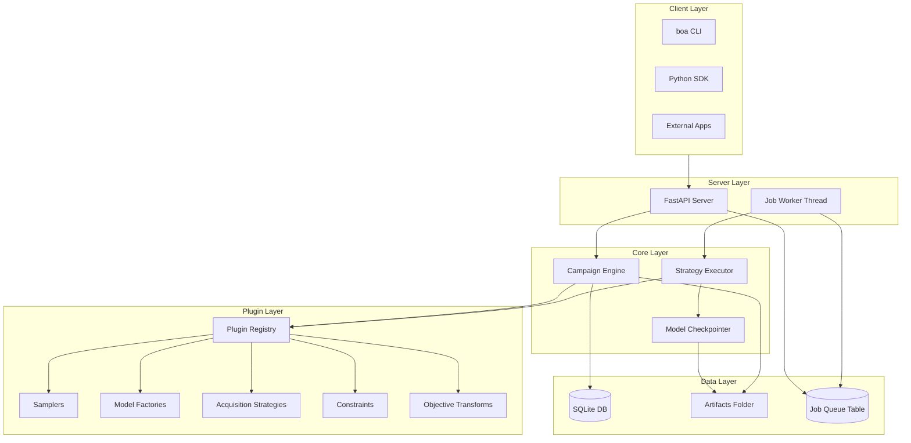
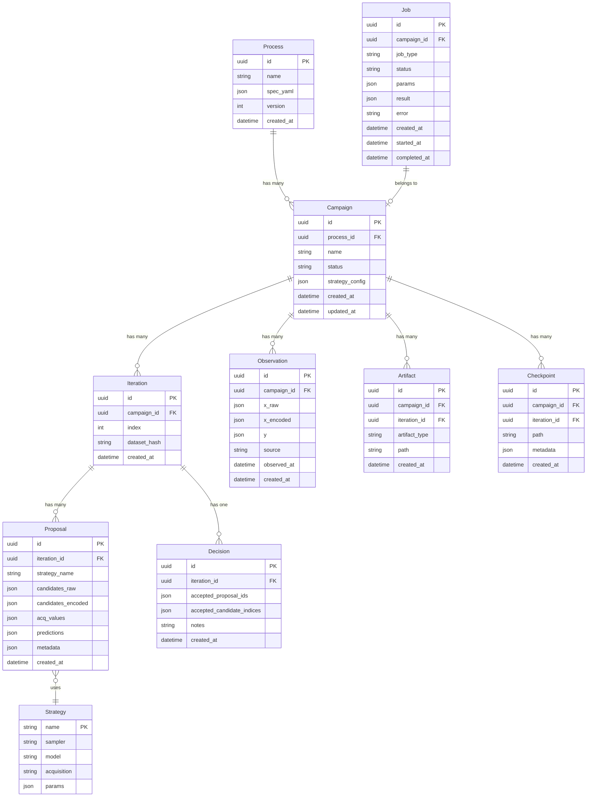
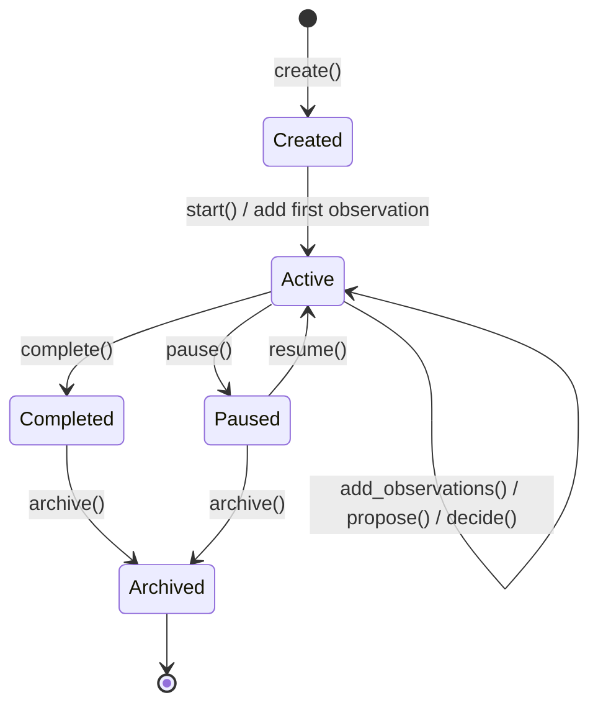

# BOA Unified Implementation Plan

## Executive Summary

BOA (Bayesian Optimization Assistant) is a server-hosted multi-objective optimization platform. It extends MOBO-Kit with:

- **Campaign management** with persistent state and multi-strategy proposal tracking
- **Pluggable workflow components** (samplers, models, acquisition, constraints, objectives)
- **Mixed + conditional variable spaces** (categorical, discrete, continuous, with `active_if` dependencies)
- **Preference/utility objectives** (maximize/minimize, weighted utility, aspiration levels)
- **Async job queue** for long-running proposal generation
- **Model checkpointing** for crash recovery
- **Synthetic benchmarking** (DTLZ, ZDT, ThinFilmToySuite) and real-campaign comparisons
- **Docker deployment** from day one

**Breaking change**: `mobo_kit` becomes legacy. BOA is the new primary interface.---

## Architecture Overview



---

## Key Design Decisions

| Decision | Choice | Rationale ||----------|--------|-----------|| Package location | `src/boa/` | Clean separation from legacy `mobo_kit` || Real-time sync | No WebSocket v1 | Simplify v1; clients poll or use job completion || Model checkpointing | Yes | Long campaigns need crash recovery || Docker | Yes for v1 | Production deployment from day one || Long-running jobs | Async with SQLite queue | Survives restarts, no external deps || Concurrency | Single-writer per campaign | Queue writes, allow reads; prevents race conditions || DB migrations | Alembic | Industry standard for schema evolution || Backward compat | Breaking OK | BOA is the new interface; document migration || Mixed spaces | Full in v1 | Categorical + conditional + dependencies || Preferences | Full in v1 | Weighted utility, aspiration levels || Test coverage | 80%+ per layer | Solid foundation for a complex system |---

## Data Model

### Entity Relationship




### Campaign State Machine



---

## Development Phases (Horizontal Layers)

Each phase completes an entire layer with 80%+ test coverage before moving to the next.

### Phase 1: Database Layer

**Goal**: Complete persistence layer with Alembic migrations, job queue, and repository pattern.**Files to create**:

- `src/boa/__init__.py`
- `src/boa/db/__init__.py`
- `src/boa/db/models.py` - SQLModel ORM models for all entities
- `src/boa/db/repository.py` - Repository classes (ProcessRepo, CampaignRepo, etc.)
- `src/boa/db/migrations/` - Alembic setup + initial migration
- `src/boa/db/job_queue.py` - SQLite-backed job queue (enqueue, dequeue, update status)
- `src/boa/db/connection.py` - Connection management, session factory
- `tests/boa/db/test_models.py`
- `tests/boa/db/test_repository.py`
- `tests/boa/db/test_job_queue.py`

**Key interfaces**:

```python
# repository.py
class CampaignRepo:
    def create(self, process_id: UUID, name: str, strategy_config: dict) -> Campaign
    def get(self, campaign_id: UUID) -> Campaign | None
    def list(self, process_id: UUID | None = None, status: str | None = None) -> list[Campaign]
    def update_status(self, campaign_id: UUID, status: str) -> Campaign
    def acquire_write_lock(self, campaign_id: UUID, timeout: float = 30.0) -> bool
    def release_write_lock(self, campaign_id: UUID) -> None

# job_queue.py
class JobQueue:
    def enqueue(self, campaign_id: UUID, job_type: str, params: dict) -> UUID
    def dequeue(self) -> Job | None  # returns oldest pending job
    def update_status(self, job_id: UUID, status: str, result: dict | None = None, error: str | None = None)
    def get_job(self, job_id: UUID) -> Job | None
    def list_jobs(self, campaign_id: UUID, status: str | None = None) -> list[Job]
```

**Tests required**: CRUD for each entity, job queue lifecycle, write lock acquire/release, Alembic migration up/down.---

### Phase 2: Spec Models + Validation

**Goal**: Define ProcessSpec schema supporting mixed+conditional spaces and preference objectives, with full validation.**Files to create**:

- `src/boa/spec/__init__.py`
- `src/boa/spec/models.py` - Pydantic models for ProcessSpec, InputSpec, ObjectiveSpec, ConstraintSpec, StrategySpec
- `src/boa/spec/validators.py` - Custom validators (conditional dependencies, preference consistency)
- `src/boa/spec/encoder.py` - Encode/decode mixed spaces (categorical, conditional, to/from numeric)
- `src/boa/spec/loader.py` - Load ProcessSpec from YAML, validate, parse
- `tests/boa/spec/test_models.py`
- `tests/boa/spec/test_encoder.py`
- `tests/boa/spec/test_loader.py`

**ProcessSpec structure** (YAML example):

```yaml
name: perovskite_optimization
version: 1

inputs:
    - name: temperature_c
    type: continuous
    bounds: [25, 150]
    
    - name: coating_speed
    type: discrete
    values: [10, 20, 30, 40, 50]
    unit: mm/s
    
    - name: solvent
    type: categorical
    values: [DMF, DMSO, GBL, NMP]
    
    - name: additive
    type: categorical
    values: [none, MACl, FAI, CsI]
    
    - name: additive_concentration
    type: continuous
    bounds: [0.01, 0.5]
    active_if:
      additive: [MACl, FAI, CsI]  # only active when additive is not 'none'

objectives:
    - name: efficiency
    direction: maximize
    
    - name: stability
    direction: maximize
    preference:
      type: aspiration
      target: 1000  # hours
      
    - name: cost
    direction: minimize
    preference:
      type: weight
      value: 0.5  # less important than others

constraints:
  input:
        - type: clausius_clapeyron
      absolute_humidity_col: absolute_humidity
      temperature_col: temperature_c
      
  outcome:
        - type: threshold
      objective: efficiency
      operator: ">="
      value: 15.0

strategies:
  default:
    sampler: lhs_optimized
    model: gp_matern
    acquisition: qlogNEHVI
    
  exploration:
    sampler: lhs_optimized
    model: gp_rbf
    acquisition: qNEHVI
    acquisition_params:
      eta: 0.1
```

**Encoder responsibilities**:

- Categorical: one-hot or integer encoding with indicator
- Conditional: add activity indicator columns, mask inactive variables
- Decode: reverse transform from encoded back to raw

**Tests required**: Valid spec parsing, invalid spec rejection, conditional dependency validation, encoding round-trip, edge cases (empty categories, all-inactive rows).---

### Phase 3: Plugin Registry

**Goal**: Complete plugin system with discovery, registration, and built-in plugins wrapping mobo_kit.**Files to create**:

- `src/boa/plugins/__init__.py`
- `src/boa/plugins/registry.py` - PluginRegistry class with type-safe registration
- `src/boa/plugins/base.py` - Abstract base classes for each plugin type
- `src/boa/plugins/discovery.py` - Entry-point discovery for third-party plugins
- `src/boa/plugins/samplers/__init__.py` - Built-in samplers
- `src/boa/plugins/samplers/lhs.py` - Wraps `mobo_kit.lhs`
- `src/boa/plugins/samplers/sobol.py` - Sobol sequence sampler
- `src/boa/plugins/models/__init__.py`
- `src/boa/plugins/models/gp.py` - Wraps `mobo_kit.models`
- `src/boa/plugins/acquisition/__init__.py`
- `src/boa/plugins/acquisition/qnehvi.py` - Wraps `mobo_kit.acquisition`
- `src/boa/plugins/acquisition/pool_based.py` - Pool-based acquisition for mixed spaces
- `src/boa/plugins/constraints/__init__.py`
- `src/boa/plugins/constraints/physical.py` - Clausius-Clapeyron, etc.
- `src/boa/plugins/constraints/outcome.py` - Outcome threshold constraints
- `src/boa/plugins/objectives/__init__.py`
- `src/boa/plugins/objectives/transforms.py` - Preference transforms (weighted, aspiration)
- `src/boa/plugins/metrics/__init__.py`
- `src/boa/plugins/metrics/hypervolume.py` - Wraps `mobo_kit.metrics`
- `tests/boa/plugins/test_registry.py`
- `tests/boa/plugins/test_samplers.py`
- `tests/boa/plugins/test_models.py`
- `tests/boa/plugins/test_acquisition.py`

**Key interfaces**:

```python
# base.py
class BaseSampler(ABC):
    @abstractmethod
    def sample(self, spec: ProcessSpec, n: int, constraints: list[Constraint], seed: int) -> pd.DataFrame: ...

class BaseModelFactory(ABC):
    @abstractmethod
    def fit(self, X: torch.Tensor, Y: torch.Tensor, spec: ProcessSpec) -> ModelListGP: ...

class BaseAcquisition(ABC):
    @abstractmethod
    def propose(self, model: ModelListGP, spec: ProcessSpec, train_X: torch.Tensor, 
                ref_point: torch.Tensor, batch_size: int, constraints: list) -> ProposalResult: ...

class BaseObjectiveTransform(ABC):
    @abstractmethod
    def transform(self, Y: torch.Tensor, spec: ProcessSpec) -> torch.Tensor: ...
    @abstractmethod
    def inverse_transform(self, Y_transformed: torch.Tensor) -> torch.Tensor: ...

# registry.py
class PluginRegistry:
    def register_sampler(self, name: str, plugin: type[BaseSampler]) -> None
    def register_model(self, name: str, plugin: type[BaseModelFactory]) -> None
    def get_sampler(self, name: str) -> BaseSampler
    def get_model(self, name: str) -> BaseModelFactory
    def list_plugins(self, plugin_type: str) -> list[str]
    def discover_entrypoints(self) -> None  # load from entry_points
```

**Tests required**: Registration, retrieval, discovery, plugin execution with mock data, pool-based acquisition with mixed space.---

### Phase 4: Core Engine + Checkpointing

**Goal**: Campaign engine with multi-strategy execution, proposal ledger, single-writer locking, and model checkpointing.**Files to create**:

- `src/boa/core/__init__.py`
- `src/boa/core/engine.py` - CampaignEngine: main orchestrator
- `src/boa/core/strategy.py` - StrategyExecutor: runs a single strategy pipeline
- `src/boa/core/checkpoint.py` - ModelCheckpointer: save/load fitted models
- `src/boa/core/proposal.py` - ProposalLedger: manage proposals, decisions, counterfactuals
- `src/boa/core/analyzer.py` - CampaignAnalyzer: Pareto front, convergence, model quality
- `tests/boa/core/test_engine.py`
- `tests/boa/core/test_strategy.py`
- `tests/boa/core/test_checkpoint.py`
- `tests/boa/core/test_proposal.py`

**Key interfaces**:

```python
# engine.py
class CampaignEngine:
    def __init__(self, db_path: Path, artifacts_path: Path, registry: PluginRegistry): ...
    
    def create_process(self, spec: ProcessSpec) -> Process
    def create_campaign(self, process_id: UUID, name: str, strategies: list[str]) -> Campaign
    
    def add_observations(self, campaign_id: UUID, observations: pd.DataFrame, source: str = "user") -> int
    def get_observations(self, campaign_id: UUID) -> pd.DataFrame
    
    def propose(self, campaign_id: UUID, batch_size: int, strategies: list[str] | None = None) -> dict[str, ProposalResult]
    # Returns: {strategy_name: ProposalResult} for each configured strategy
    
    def decide(self, campaign_id: UUID, iteration_id: UUID, 
               accepted: list[tuple[str, list[int]]], notes: str = "") -> Decision
    # accepted: list of (strategy_name, candidate_indices) tuples
    
    def get_iteration(self, campaign_id: UUID, index: int) -> Iteration
    def get_proposals(self, iteration_id: UUID) -> list[Proposal]
    def get_counterfactuals(self, iteration_id: UUID) -> list[Proposal]  # proposals not in decision
    
    def get_pareto_front(self, campaign_id: UUID) -> pd.DataFrame
    def get_hypervolume_history(self, campaign_id: UUID) -> list[float]

# checkpoint.py
class ModelCheckpointer:
    def save(self, campaign_id: UUID, iteration_id: UUID, model: ModelListGP, metadata: dict) -> Path
    def load(self, campaign_id: UUID, iteration_id: UUID | None = None) -> tuple[ModelListGP, dict] | None
    # if iteration_id is None, load latest
    def list_checkpoints(self, campaign_id: UUID) -> list[Checkpoint]
    def cleanup(self, campaign_id: UUID, keep_last: int = 5) -> int  # returns num deleted
```

**Single-writer locking**: `propose()` and `add_observations()` acquire campaign write lock; return 423 Locked if can't acquire within timeout.**Tests required**: Full campaign lifecycle, multi-strategy proposal, decision with subset, counterfactual retrieval, checkpoint save/load/resume, concurrent write rejection.---

### Phase 5: FastAPI Server + Job Worker

**Goal**: REST API with async job handling for long-running proposals.**Files to create**:

- `src/boa/server/__init__.py`
- `src/boa/server/main.py` - FastAPI app, lifespan, middleware
- `src/boa/server/routes/__init__.py`
- `src/boa/server/routes/processes.py` - CRUD for processes
- `src/boa/server/routes/campaigns.py` - CRUD + state transitions
- `src/boa/server/routes/observations.py` - Add/get observations
- `src/boa/server/routes/proposals.py` - Submit proposal job, get results
- `src/boa/server/routes/jobs.py` - Job status, list, cancel
- `src/boa/server/routes/benchmarks.py` - Benchmark endpoints
- `src/boa/server/schemas.py` - Pydantic request/response schemas
- `src/boa/server/worker.py` - Background job worker thread
- `src/boa/server/deps.py` - Dependency injection (engine, registry)
- `tests/boa/server/test_processes.py`
- `tests/boa/server/test_campaigns.py`
- `tests/boa/server/test_proposals.py`
- `tests/boa/server/test_jobs.py`

**API Endpoints**:

```javascript
POST   /api/v1/processes                    Create process from YAML spec
GET    /api/v1/processes                    List processes
GET    /api/v1/processes/{id}               Get process details
PUT    /api/v1/processes/{id}               Update process (creates new version)

POST   /api/v1/campaigns                    Create campaign
GET    /api/v1/campaigns                    List campaigns (filter by process, status)
GET    /api/v1/campaigns/{id}               Get campaign details
POST   /api/v1/campaigns/{id}/pause         Pause campaign
POST   /api/v1/campaigns/{id}/resume        Resume campaign
POST   /api/v1/campaigns/{id}/complete      Mark complete
POST   /api/v1/campaigns/{id}/archive       Archive campaign

POST   /api/v1/campaigns/{id}/observations  Add observations (CSV or JSON)
GET    /api/v1/campaigns/{id}/observations  Get all observations

POST   /api/v1/campaigns/{id}/propose       Submit proposal job (returns job_id)
GET    /api/v1/campaigns/{id}/iterations    List iterations
GET    /api/v1/iterations/{id}/proposals    Get proposals for iteration
POST   /api/v1/iterations/{id}/decide       Accept subset of proposals

GET    /api/v1/jobs/{id}                    Get job status + result
GET    /api/v1/campaigns/{id}/jobs          List jobs for campaign
DELETE /api/v1/jobs/{id}                    Cancel pending job

GET    /api/v1/campaigns/{id}/pareto        Get Pareto front
GET    /api/v1/campaigns/{id}/hypervolume   Get hypervolume history
GET    /api/v1/campaigns/{id}/artifacts     List artifacts

GET    /api/v1/benchmarks/suites            List available benchmark suites
POST   /api/v1/benchmarks/run               Submit benchmark job
GET    /api/v1/benchmarks/{id}              Get benchmark results

GET    /health                              Health check
```

**Job worker**: Background thread that polls job queue, executes proposal generation, updates job status.**Tests required**: All endpoints happy path, error cases, job lifecycle, concurrent request handling (write lock rejection).---

### Phase 6: Python SDK

**Goal**: Ergonomic Python client for BOA server.**Files to create**:

- `src/boa/sdk/__init__.py`
- `src/boa/sdk/client.py` - BOAClient class (sync wrapper around httpx)
- `src/boa/sdk/models.py` - Client-side dataclasses mirroring API schemas
- `src/boa/sdk/campaign.py` - Campaign helper class with fluent API
- `src/boa/sdk/exceptions.py` - Custom exceptions
- `tests/boa/sdk/test_client.py`
- `tests/boa/sdk/test_campaign.py`

**Usage example**:

```python
from boa.sdk import BOAClient, Campaign

client = BOAClient("http://localhost:8000")

# Create process from YAML
process = client.create_process_from_yaml("configs/my_process.yaml")

# Create campaign
campaign = Campaign.create(client, process_id=process.id, name="run_001", strategies=["default", "exploration"])

# Add initial data
campaign.add_observations(pd.read_csv("initial_data.csv"))

# Propose next batch (async - returns immediately)
job = campaign.propose(batch_size=5)

# Wait for completion
proposals = job.wait(timeout=300)  # dict[strategy_name, ProposalResult]

# Review proposals from each strategy
for strategy, result in proposals.items():
    print(f"{strategy}: {len(result.candidates)} candidates")
    print(result.candidates)

# Accept subset: take top 3 from default, top 2 from exploration
campaign.decide(iteration_id=proposals["default"].iteration_id, accepted=[
    ("default", [0, 1, 2]),
    ("exploration", [0, 1])
])

# Get Pareto front
pareto = campaign.get_pareto_front()

# Export campaign
campaign.export("my_campaign_bundle.zip")
```

**Tests required**: Full workflow integration test, error handling, timeout behavior.---

### Phase 7: Benchmarking

**Goal**: Synthetic benchmark suites and real-campaign comparison tools.**Files to create**:

- `src/boa/benchmarks/__init__.py`
- `src/boa/benchmarks/suites/__init__.py`
- `src/boa/benchmarks/suites/dtlz.py` - DTLZ1-7
- `src/boa/benchmarks/suites/zdt.py` - ZDT1-6
- `src/boa/benchmarks/suites/constrained.py` - C2DTLZ2, OSY, TNK
- `src/boa/benchmarks/suites/thinfilm.py` - ThinFilmToySuite (domain-inspired)
- `src/boa/benchmarks/runner.py` - BenchmarkRunner
- `src/boa/benchmarks/report.py` - Generate comparison reports
- `src/boa/benchmarks/replay.py` - Replay strategies on historical campaign data
- `tests/boa/benchmarks/test_suites.py`
- `tests/boa/benchmarks/test_runner.py`

**ThinFilmToySuite** (domain-inspired synthetic):

- Inputs: temperature (continuous), speed (discrete), solvent (categorical), additive (categorical), concentration (conditional on additive)
- Objectives: efficiency (maximize), stability (maximize), cost (minimize)
- Constraints: Clausius-Clapeyron inspired, outcome threshold on efficiency
- Noise: heteroscedastic to simulate real measurement variability

**Tests required**: Each suite produces valid Pareto fronts, runner executes to completion, replay produces valid counterfactual comparisons.---

### Phase 8: CLI + Docker + Export/Import

**Goal**: Command-line interface, Docker deployment, and campaign export/import.**Files to create**:

- `src/boa/cli/__init__.py`
- `src/boa/cli/main.py` - Typer-based CLI
- `src/boa/cli/commands/serve.py` - Start server
- `src/boa/cli/commands/process.py` - Process management
- `src/boa/cli/commands/campaign.py` - Campaign management
- `src/boa/cli/commands/benchmark.py` - Run benchmarks
- `src/boa/cli/commands/export.py` - Export/import bundles
- `src/boa/export/__init__.py`
- `src/boa/export/bundle.py` - Create/extract campaign bundles
- `Dockerfile`
- `docker-compose.yml`
- `.dockerignore`
- `tests/boa/cli/test_commands.py`
- `tests/boa/export/test_bundle.py`

**CLI commands**:

```bash
boa serve --port 8000 --db ./data/boa.db
boa process create my_process.yaml
boa process list
boa campaign create --process my_process --name run_001
boa campaign add-data run_001 --csv data.csv
boa campaign propose run_001 --batch-size 5 --wait
boa campaign decide run_001 --accept default:0,1,2 --accept exploration:0
boa campaign export run_001 --output bundle.zip
boa campaign import bundle.zip
boa benchmark list-suites
boa benchmark run --suite dtlz --strategies default,exploration --output report.html
```

**Docker**:

```dockerfile
# Multi-stage build
FROM python:3.11-slim as builder
# ... install deps, build wheel

FROM python:3.11-slim as runtime
# ... copy wheel, create user, set up volumes
HEALTHCHECK CMD curl -f http://localhost:8000/health || exit 1
EXPOSE 8000
CMD ["boa", "serve", "--host", "0.0.0.0"]
```

**Export bundle** contains:

- `process.yaml` - Process spec
- `campaign.json` - Campaign metadata
- `boa.db` - SQLite database
- `artifacts/` - All generated artifacts
- `checkpoints/` - Model checkpoints
- `requirements.txt` - pip freeze for reproducibility

---

### Phase 9: Documentation + Examples

**Goal**: Comprehensive docs and working examples.**Files to create**:

- Update `README.md` with BOA quick start
- `docs/` folder with:
- `getting-started.md`
- `process-spec.md`
- `api-reference.md`
- `plugin-development.md`
- `benchmarking.md`
- `deployment.md`
- `examples/` folder with:
- `01_basic_campaign.py`
- `02_multi_strategy.py`
- `03_mixed_space.py`
- `04_preference_objectives.py`
- `05_benchmarking.py`
- `06_custom_plugin.py`

---

## Dependencies to Add

```javascript
# requirements.txt additions
fastapi>=0.104.0
uvicorn[standard]>=0.24.0
httpx>=0.25.0
sqlmodel>=0.0.14
alembic>=1.13.0
pydantic>=2.5.0
typer>=0.9.0
python-multipart>=0.0.6
```

---

## Testing Strategy

Each phase requires 80%+ coverage measured by `pytest --cov`. Test types:

1. **Unit tests**: Every public function/method
2. **Integration tests**: Cross-module interactions
3. **API tests**: FastAPI TestClient for all endpoints
4. **E2E tests**: Full campaign lifecycle via SDK

Use fixtures for:

- Temporary SQLite databases
- Sample ProcessSpecs (simple, mixed, conditional)
- Mock mobo_kit models (fast tests)

---

## Risk Mitigation

| Risk | Mitigation ||------|------------|| Mixed space encoding complexity | Start with simple one-hot; add smarter encodings later || Pool-based acquisition too slow | Parallelize with torch; cap pool size; cache evaluations || Async job queue race conditions | Use SQLite transactions; test concurrent access || Model checkpoints too large | Compress with torch.save; cleanup old checkpoints || Breaking mobo_kit compatibility | Clear migration docs; keep mobo_kit importable but deprecated |---

## Success Criteria

v1 is complete when:

1. A user can define a process with mixed+conditional variables and preference objectives via YAML
2. Create a campaign and add observations via CLI or SDK
3. Generate proposals from multiple strategies asynchronously
4. Accept a subset of proposals and have counterfactuals logged
5. Resume a crashed campaign from checkpoint
6. Run synthetic benchmarks and compare strategies